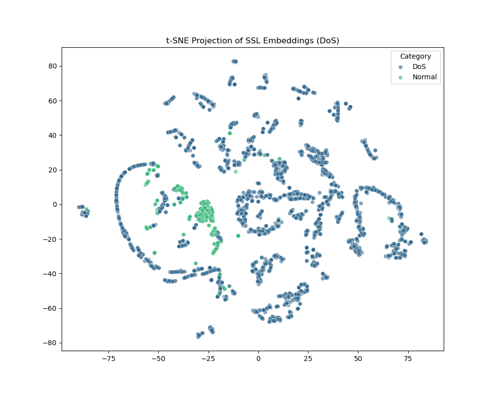

# Manifold-Based Novelty Detection for Network Intrusion

[](https://doi.org/10.5281/zenodo.18231967)



## Overview
This repository contains the official implementation and research assets for **Manifold-Based Novelty Detection**. Our approach utilizes **Contrastive Self-Supervised Learning (SSL)** to learn a behavioral baseline of "normal" network traffic without the need for malicious labels. By optimizing an MLP encoder via the **InfoNCE loss**, we project network flows into a geometrically stable latent space (a unit hypersphere) where anomalies—including zero-day exploits—can be detected as statistical displacements.

## Research Methodology

### 1. The Normalcy Manifold
Unlike supervised models that learn to identify specific attack signatures, our model learns the "Manifold of Normalcy." It identifies the structural invariants of benign traffic (e.g., session cadence, packet size distributions, flag registry patterns) and collapses them into a cohesive cluster in 32-dimensional latent space.

### 2. Contrastive SSL & InfoNCE
We utilize a contrastive objective that maximizes the mutual information between stochastic "views" of the same flow. We implement:
- **Gaussian Jitter**: To prevent overfitting to exact packet counts.
- **Feature Masking**: To force the model to learn cross-feature correlations.
- **Magnitude Scaling**: To simulate volumetric throughput fluctuations.

### 3. LOATO Evaluation Protocol
To simulate real-world **Zero-Day** scenarios, we employ the **Leave-One-Attack-Type-Out (LOATO)** protocol. We train exclusively on benign traffic and evaluate the model's ability to detect entirely unseen attack families (e.g., training on Benign and testing on a held-out DoS family).

## Repository Structure

- `src/models_contrastive.py`: Core PyTorch implementation of the SSL encoder and InfoNCE loss.
- `src/preprocess.py`: Feature normalization and scaling pipeline for the CIC-IDS2017 dataset.
- `src/splits.py`: Implementation of the LOATO data partitioner.
- `src/evaluate_contrastive.py`: Comprehensive evaluation suite for computing TPR @ 1% FPR and AUROC metrics.
- `src/score.py`: Anomaly scoring engine using regularized Mahalanobis distance (Ledoit-Wolf shrinkage).
- `results/`: Contains t-SNE visualizations and ROC curves demonstrating manifold separation.

## Security Flavor & USENIX Compliance
This project is designed for the **Network Security** track. It prioritizes:
- **Low-FPR Stability**: Benchmarked at the 1% FPR threshold to minimize SOC alert fatigue.
- **Evasion Difficulty**: Empirical analysis suggests that evasion requires high-precision tuning of multiple feature groups, increasing the practical cost for adversaries.
- **Explainability**: Latent distance can be decomposed to attribute anomaly scores back to raw feature groups (e.g., timing vs. volume).

## Getting Started

### Prerequisites
- Python 3.9+
- PyTorch 2.0+
- Pandas, Scikit-Learn, Matplotlib

### Setup
```bash
# Clone the repository
git clone https://github.com/ThryLox/ssl-ids-2026.git
cd ssl-ids-2026

# Install dependencies (Standard pip environment)
pip install torch pandas scikit-learn matplotlib
```

### Reproducing Results
1. **Download Knowledge**: Use `src/download_dataset.py` (requires manual Kaggle/CIC access for raw CSVs).
2. **Train the Manifold**:
   ```bash
   python src/models_contrastive.py
   ```
3. **Run LOATO Evaluation**:
   ```bash
   python src/evaluate_contrastive.py
   ```

## Citation
If you find this research useful, please cite our preprint:
```bibtex
@article{singh2024manifold,
  title={Manifold-Based Novelty Detection for Network Intrusion: A Contrastive Self-Supervised Approach},
  author={Singh, Ekonkar},
  journal={Zenodo},
  year={2024},
  doi={10.5281/zenodo.18231967},
  url={https://doi.org/10.5281/zenodo.18231967}
}
```
